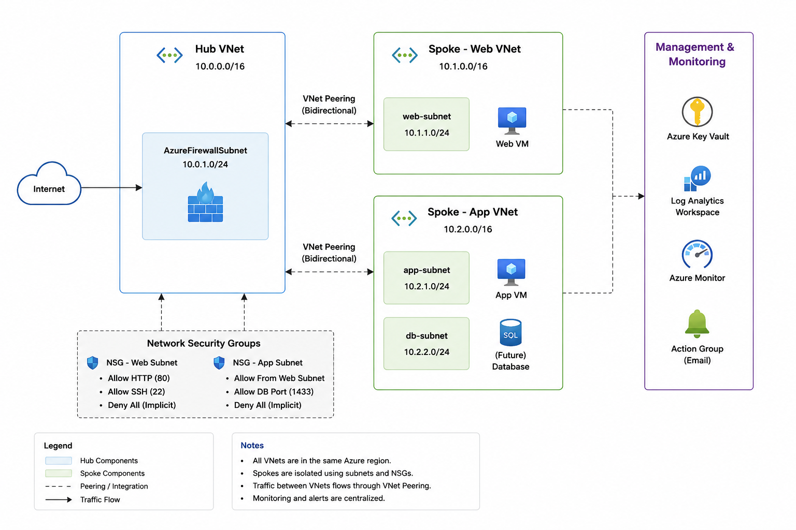

# Azure Landing Zone using Terraform

## Overview

This project demonstrates an enterprise-style Azure Landing Zone implemented using Terraform.

The infrastructure follows a Hub-and-Spoke architecture with centralized networking, monitoring, and security services.

---

## Architecture



---

## Azure Services Used

- Resource Group
- Virtual Networks
- Hub & Spoke Architecture
- VNet Peering
- Network Security Groups
- Azure Virtual Machines
- Azure Key Vault
- Log Analytics Workspace
- Azure Monitor
- Action Groups
- Metric Alerts
- Terraform

---

## Repository Structure

```
provider.tf
variables.tf
networking.tf
nsg.tf
compute.tf
keyvault.tf
monitoring.tf
outputs.tf
```

## Architecture Highlights

- Hub-and-Spoke Network Design
- VNet Peering
- Infrastructure as Code
- Secure Network Segmentation
- Azure Key Vault Integration
- Centralized Monitoring
- CPU Metric Alerts
- Action Groups
- Log Analytics Workspace

---

## Skills Demonstrated

- Microsoft Azure
- Terraform
- Infrastructure as Code
- Azure Networking
- Azure Security
- Azure Monitoring
- Cloud Operations
- Cloud Architecture

---

## Screenshots

Screenshots of all deployed resources are available inside the screenshots folder.

---

## Note

This project was manually deployed in the Azure Portal to understand the infrastructure components and networking concepts. The repository contains the equivalent Terraform Infrastructure as Code (IaC) implementation for the same architecture.
